### barista_robot_description

| Real | Diagram | Model|
| --- | --- | --- |
| 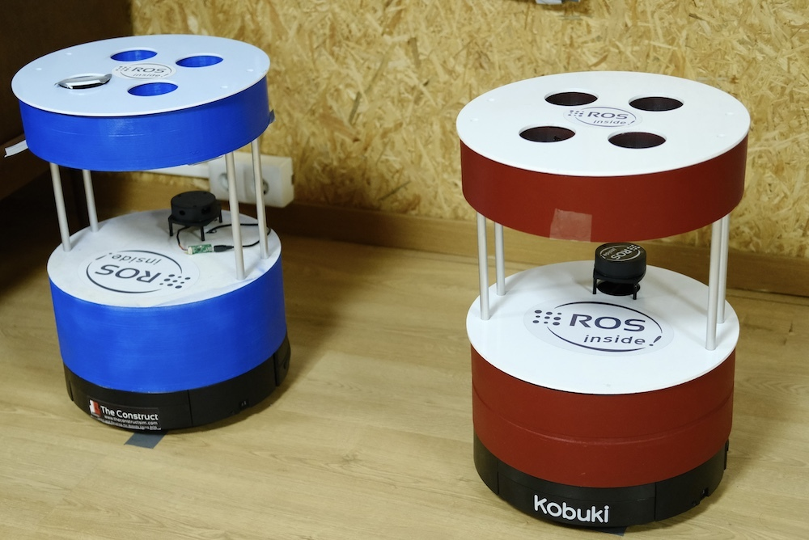 |  | 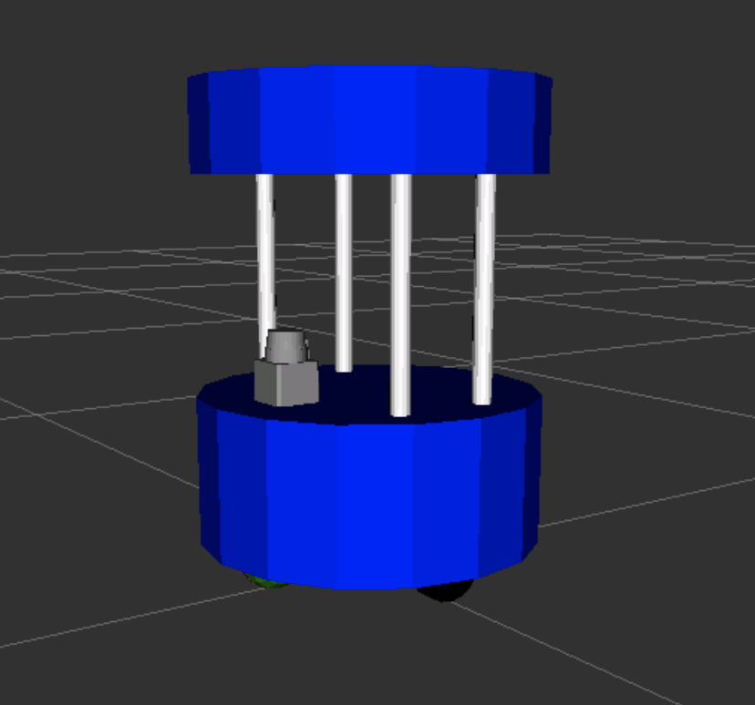 |

#### Submission notes

##### Part 1

1. Launching:
   ```
   cd ~/ros2_ws/src
   git clone https://github.com/ivogeorg/barista_robot_description.git
   cd ~/ros2_ws
   colcon build --packages-select barista_robot_description
   source install/setup.bash
   ros2 launch barista_robot_description barista_urdf.launch.py
   ```
2. Note that since the first time around it takes longer for Gazebo to start, the spawn process dies and does not populate the robot, even after Gazebo comes up. It may require to start, kill, and re-start again until the Gazebo lag diminishes. It usually happens on the second try.
3. Expected result:
   | Gazebo | Rviz2 |
   | --- | --- |
   | 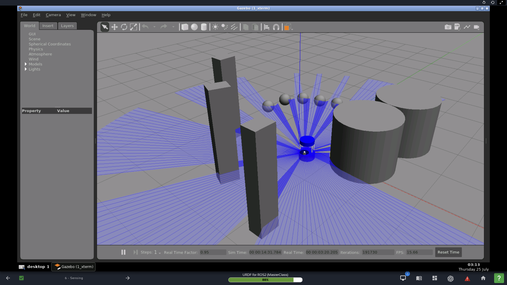 | 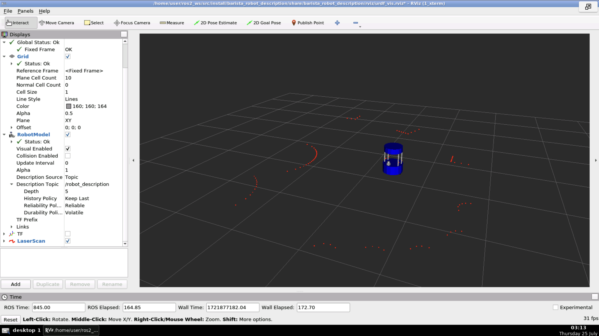 |
   

#### Implementation notes

##### 1. Handling the standoff rods

1. The robot model has a potential cycle in the design of the standoff rods. Since all rods are to attach to both `base_link` and `cup_holder`, if each rod is a separate link, `cup_holder` will have 4 joints with 4 different parents. This is a cycle and therefore not viable. Below is the result of visualizing such a model in Rviz2:  
   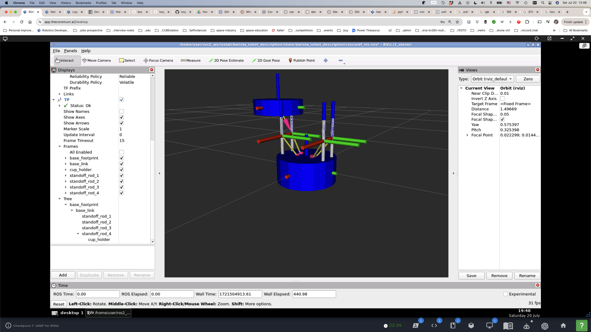  
2. The `robot_state_publisher-1` parses the structure correctly, but all but the last joint with `cup_holder` as a child is ignored to preserve the tree structure:  
   ```
   user:~/ros2_ws$ ros2 launch barista_robot_description barista_urdf_separate_rods.launch.py
   [INFO] [launch]: All log files can be found below /home/user/.ros/log/2024-07-20-19-41-12-151468-1_xterm-14068
   [INFO] [launch]: Default logging verbosity is set to INFO
   Fetching URDF ==>
   [INFO] [robot_state_publisher-1]: process started with pid [14070]
   [INFO] [rviz2-2]: process started with pid [14072]
   [rviz2-2] QStandardPaths: XDG_RUNTIME_DIR not set, defaulting to '/tmp/runtime-user'
   [robot_state_publisher-1] Link base_link had 4 children
   [robot_state_publisher-1] Link standoff_rod_1 had 1 children
   [robot_state_publisher-1] Link cup_holder had 0 children
   [robot_state_publisher-1] Link standoff_rod_2 had 1 children
   [robot_state_publisher-1] Link cup_holder had 0 children
   [robot_state_publisher-1] Link standoff_rod_3 had 1 children
   [robot_state_publisher-1] Link cup_holder had 0 children
   [robot_state_publisher-1] Link standoff_rod_4 had 1 children
   [robot_state_publisher-1] Link cup_holder had 0 children
   [robot_state_publisher-1] [INFO] [1721504472.377891927] [robot_state_publisher_node]: got segment base_footprint
   [robot_state_publisher-1] [INFO] [1721504472.377988506] [robot_state_publisher_node]: got segment base_link
   [robot_state_publisher-1] [INFO] [1721504472.378003157] [robot_state_publisher_node]: got segment cup_holder
   [robot_state_publisher-1] [INFO] [1721504472.378015203] [robot_state_publisher_node]: got segment standoff_rod_1
   [robot_state_publisher-1] [INFO] [1721504472.378026624] [robot_state_publisher_node]: got segment standoff_rod_2
   [robot_state_publisher-1] [INFO] [1721504472.378037824] [robot_state_publisher_node]: got segment standoff_rod_3
   [robot_state_publisher-1] [INFO] [1721504472.378048920] [robot_state_publisher_node]: got segment standoff_rod_4
   ```
3. Assembling all 4 rods in the same link works fine (at least in URDF):
   ```
       <link name="standoff_rods">
        <visual>
            <origin rpy="0 0 0" xyz="0.050 0.140 0"/>
            <geometry>
                <cylinder length="0.220" radius="0.010"/>
            </geometry>
            <material name="light_gray"/>
        </visual>

        <visual>
            <origin rpy="0 0 0" xyz="-0.050 0.140 0"/>
            <geometry>
                <cylinder length="0.220" radius="0.010"/>
            </geometry>
            <material name="light_gray"/>
        </visual>

        <visual>
            <origin rpy="0 0 0" xyz="0.050 -0.140 0"/>
            <geometry>
                <cylinder length="0.220" radius="0.010"/>
            </geometry>
            <material name="light_gray"/>
        </visual>

        <visual>
            <origin rpy="0 0 0" xyz="-0.050 -0.140 0"/>
            <geometry>
                <cylinder length="0.220" radius="0.010"/>
            </geometry>
            <material name="light_gray"/>
        </visual>

        <!-- collision -->
        <collision>
            <origin rpy="0 0 0" xyz="0.050 0.140 0"/>
            <geometry>
                <cylinder length="0.220" radius="0.010"/>
            </geometry>
        </collision>

        <collision>
            <origin rpy="0 0 0" xyz="-0.050 0.140 0"/>
            <geometry>
                <cylinder length="0.220" radius="0.010"/>
            </geometry>
        </collision>

        <collision>
            <origin rpy="0 0 0" xyz="0.050 -0.140 0"/>
            <geometry>
                <cylinder length="0.220" radius="0.010"/>
            </geometry>
        </collision>

        <collision>
            <origin rpy="0 0 0" xyz="-0.050 -0.140 0"/>
            <geometry>
                <cylinder length="0.220" radius="0.010"/>
            </geometry>
            <material name="light_gray"/>
        </collision>

        <!-- approximate a very light box with rods on the edges -->
        <inertial>
            <mass value="0.02"/>
            <origin rpy="0 0 0" xyz="0 0 0"/>
            <inertia ixx="0.0002113333333333334" ixy="0.0" ixz="0.0" iyy="9.733333333333335e-05" iyz="0.0" izz="0.00014733333333333335"/>
        </inertial>

    </link>

    <joint name="joint_base_link_standoff_rods" type="fixed">
        <origin rpy="0 0 0" xyz="0 0 0.1875"/>
        <parent link="base_link"/>
        <child link="standoff_rods"/>
        <axis xyz="0 0 0"/>
    </joint>
   ```
4. The only problem is that the inertia has to be approximated. In this case, it is approximated by a light box formed by the rods, with the default inertial center of the assembly link falling in between the rods.

##### 2. Laser scanner setup

1. Picked the [Hokuyo URG-04LX mesh](https://bitbucket.org/theconstructcore/checkpoint4_auxiliary_files/src/master/meshes/hokuyo_urg_04lx.dae). Note that this scanner is not 360-deg.
2. Mass and dimensions for `inertial` read off the [spec sheet](https://www.hokuyo-aut.jp/dl/Specifications_URG-04LX_1513063395.pdf).
   1. Mass: 160 g.
   2. Dimensions: 50 x 50 x 70 mm. Simpler `collision`, a box instead of the full mesh.

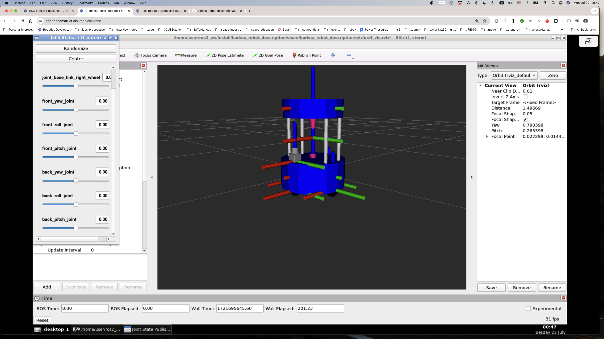  

3. To visualize the frame tree:
   ```
   sudo apt update
   printenv ROS_DISTRO # e.g. humble
   sudo apt install ros-humble-rqt-tf-tree
   ros2 run ros2 run rqt_tf_tree rqt_tf_tree
   ```  

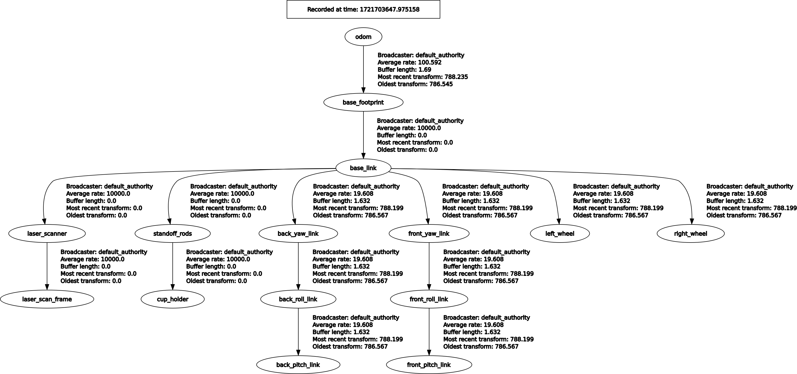  

###### 2.1 Errors

1. ~The scanner rays are not visible in Gazebo despite `<visualize>true</visualize>` and the laser scanner subscriber in Rviz2 showing the rays hitting the objects set around the robot.~ _Works on Galactic, Gazebo 11.9.0, not in Humble, Gazebo 11.10.2._
2. ~The scanner rays emanate from the center of `base_footprint` despite creating a (virtual) link `laser_scan_frame` and connecting it to the `laser_scanner` link with a fixed joint and then referencing the laser scanner plugin to `laser_scan_frame`. Changing the `pose` in the `<gazebo>` plugin config in the URDF file doesn't change the position either.~ _Adding `<frame_name>laser_scan_frame</frame_name>` fixes the problem._  

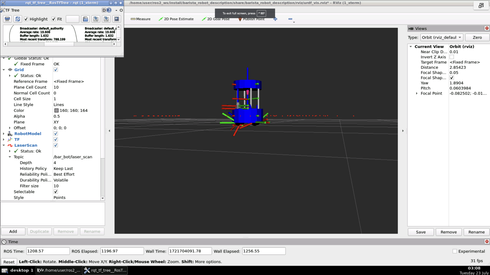  

```
  <gazebo reference="laser_scan_frame">
    <sensor name="sensor_ray" type="ray">
      <pose>0 0 0 0 0 0</pose>
      <ray>
        <scan>
          <horizontal>
            <samples>200</samples>
            <resolution>1.0</resolution>
            <min_angle>-3.14</min_angle>
            <max_angle>3.14</max_angle>
          </horizontal>
        </scan>
        <range>
          <min>0.1</min>
          <!-- <min>0.4</min> -->
          <max>5.0</max>
        </range>
      </ray>
      <always_on>true</always_on>
      <visualize>true</visualize>
      <!-- <update_rate>100.0</update_rate> -->
      <update_rate>10.0</update_rate> <!-- 10, 15, 20, 30 Hz -->
      <plugin name="laser" filename="libgazebo_ros_ray_sensor.so">
        <ros>
          <namespace>/bar_bot</namespace>
          <remapping>~/out:=laser_scan</remapping>
        </ros>
        <output_type>sensor_msgs/LaserScan</output_type>
        <frame_name>laser_scan_frame</frame_name>
      </plugin>
    </sensor>
  </gazebo>
```  

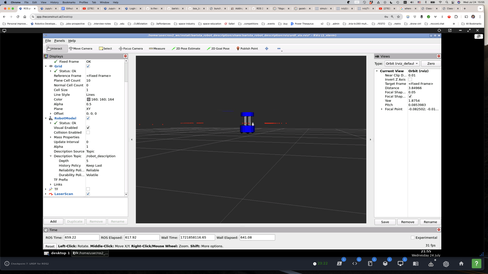  

3. In the following images, the `laser_scan_frame` link is positioned at 1 m above its parent `laser_scanner` link. Rviz2 TF shows this correctly. However, the scanner rays don't show in Gazebo and show at the height of the center of the `base_footprint` or `base_link`. The reason it shows at all is that the box in Gazebo it's detecting is 2 m high.  

| Gazebo | Rviz2 |
| --- | --- |
| 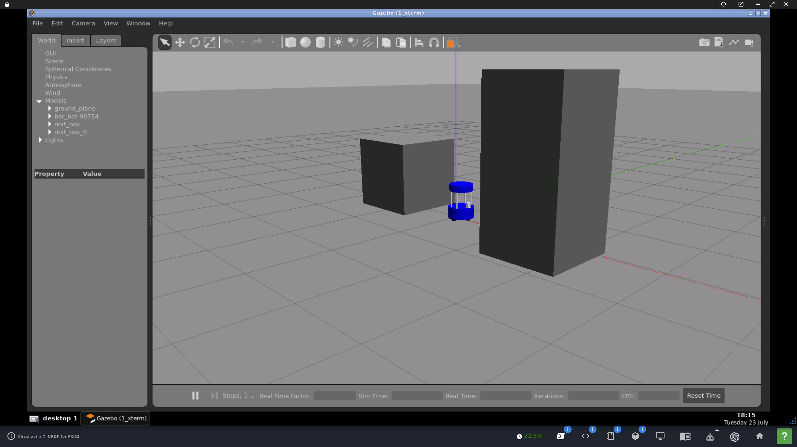 | 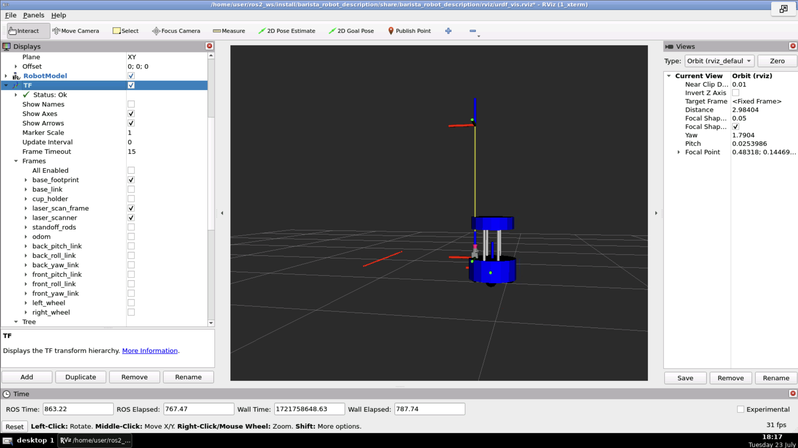 |  


##### 3. Launching

1. To visualize the URDF model in Rviz2:
   1. Launch description for nodes `robot_state_publisher_node` and `rviz_node`:
      ```
      cd ~/ros2_ws
      colcon build
      source install/setup.bash
      ros2 launch barista_robot_description visualize_barista_urdf.launch.py
      ```
   2. Launch `joint_state_publisher_gui`:
      ```
      ros2 run joint_state_publisher_gui joint_state_publisher_gui
      ```
2. (goal) Full launch of nodes `gazebo`, `robot_state_publisher_node`, `rviz_node`, and `spawn_robot`.
   1. Funcionality of nodes:
      1. `gazebo`: Launches Gazebo simulator with ROS and the `worlds/bar_bot_empty.world` world file.
      2. `robot_state_publisher_node`: Publishes the URDF/Xacro file to the `/robot_description` topic (package and executable `robot_state_publisher`) the static TFs.
      3. `rviz_node`: Launches Rviz2 with 'rviz/urdf_vis.rviz' config file.
      4. `spawn_robot`: Spawns the robot from the `/robot_description` topic (pacakge `gazebo_ros` and executable `spawn_entity.py`) in Gazebo with give position and orientation.
      5. **Note:** Instead of the `joint_state_publisher_gui` to publish joint states (needed by RViz2 to show all links connected by non-`fixed` joints), the URDF/Xacro file now has the `bar_bot_joint_state` plugin, allowing getting the joint states directly from Gazebo.
   2. Command-line launch:
      ```
      cd ~/ros2_ws
      colcon build
      source install/setup.bash
      ros2 launch barista_robot_description barista_urdf.launch.py
      ```

###### 3.1 Errors

1. There is an ALSA error on launching Gazebo:
```
[gzserver-1] ALSA lib confmisc.c:855:(parse_card) cannot find card '0'
[gzserver-1] ALSA lib conf.c:5178:(_snd_config_evaluate) function snd_func_card_inum returned error: No such file or directory
[gzserver-1] ALSA lib confmisc.c:422:(snd_func_concat) error evaluating strings
[gzserver-1] ALSA lib conf.c:5178:(_snd_config_evaluate) function snd_func_concat returned error: No such file or directory
[gzserver-1] ALSA lib confmisc.c:1334:(snd_func_refer) error evaluating name
[gzserver-1] ALSA lib conf.c:5178:(_snd_config_evaluate) function snd_func_refer returned error: No such file or directory
[gzserver-1] ALSA lib conf.c:5701:(snd_config_expand) Evaluate error: No such file or directory
[gzserver-1] ALSA lib pcm.c:2664:(snd_pcm_open_noupdate) Unknown PCM default
[gzserver-1] AL lib: (EE) ALCplaybackAlsa_open: Could not open playback device 'default': No such file or directory
```

ALSA is The Advanced Linux Sound Architecture, which is of no use for this project. Seems to be innocuous.

2. Managed to launch the world separately (`gazebo`) and then the `robot_state_publisher_node` and `rviz_node` together and then `spawn_robot` just as it was done for the Box Bot final, that is, by launching the world first and then launching an `xml` file with two `launch` `include file`-s, but can't make it work lanching them manually Neither do I know how to launch them all correctly from a single launch file.
   ```
   cd ~/ros2_ws
   colcon build
   source install/setup.bash
   ros2 launch barista_robot_description start_gazebo_world.launch.py
   ```
   and
   ```
   cd ~/ros2_ws
   source install/setup.bash
   ros2 launch barista_robot_description spawn_bar_bot_ros2.launch.xml
   ```
   where the xml file contains
   ```
   <?xml version='1.0' ?>
       <launch>
       <!-- Publish URDF file in robot_description topic -->
       <include file="$(find-pkg-share barista_robot_description)/launch/visualize_barista_urdf.launch.py"/>
       <!-- Read robot_description and spawn in gazebo running sim -->
       <include file="$(find-pkg-share barista_robot_description)/launch/spawn_robot_description.launch.py"/>
   </launch>
   ```  

##### 4. Masses

1. Base: [5 kg](https://iclebo-kobuki.readthedocs.io/en/latest/specifications.html).
2. Laser scanner: 0.160 kg.
3. Cup holder: 1 kg.
4. Standoff rods (total): 0.4 kg.
5. Wheels (each): 0.08 kg.
6. Casters (each cylinder): 0.001 kg.
7. Casters (sphere): 0.06 kg.


   
